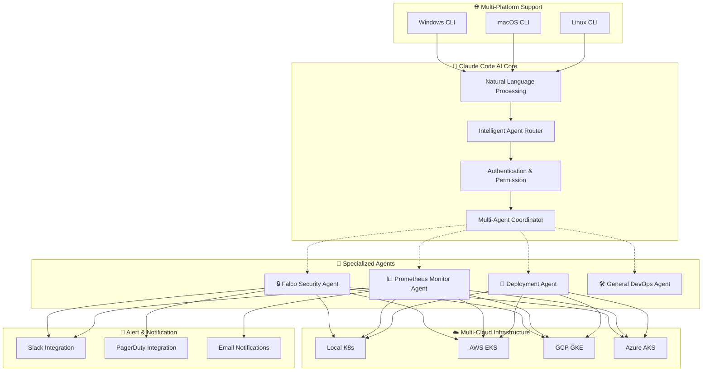

# A2A-DevOps
An experimental repository for an agent-to-agent DevOps system based on ClaudeCode MCP.

[]()
[]()
[]()

---

## 📊 시스템 전체 구조 시각화

<table>
  <tr>
    <td></td>
  </tr>
  <tr>
    <td></td>
    <td></td>
  </tr>
</table>

---

## 핵심 비전 및 목표

### 구현 목표
**"자연어 기반 지능형 DevOps 자동화 플랫폼"**

사용자의 자연어 명령이 Claude Code에 전달되고, 그 하위 sub-agent들에게 전달되어 실질적인 쿠버네티스 환경을 managing하는 명령어로 변환되고 실행됩니다.

즉, **평범한 LLM Chat UX를 통해 쿠버네티스 환경 조작에 접근하고, 수준 높은 자동화 달성**을 목표로 합니다.

### 🚀 추구하는 경지
**하위 sub-agent 동작에서, 단순 LangGraph 형식의 순차적인 agent 접근이 아니라, 여러 agent가 Claude Code MCP 하에서 상호 능동적인 협력을 할 수 있는가?**

### 🌐 핵심 전제
- **멀티클라우드 지원**: 사용자 local 쿠버네티스 환경 및 외부 클라우드 시스템(AWS EKS, GCP GKE, Azure AKS 등)의 쿠버네티스 환경을 모두 지원
- **RBAC 기반 보안**: Role-Based-Access-Control을 통한 IAM 권한 관리
- **실시간 데이터**: 실제 클러스터 연결 기반 운영

---

## 🎨 혁신적 가치 제안

### 🔑 핵심 가치
**"보안과 신뢰성을 유지하면서 복잡한 DevOps 운영을 간단한 자연어 대화로 변환하고 제공한다."**

### ⭐ 주요 혁신 기능
- **🚀 원클릭 모니터링 스택 배포**: 자연어 명령으로 Falco, Prometheus 등 전체 모니터링 인프라 자동 설치
- **🔔 지능형 실시간 알림**: Falco 보안 이벤트의 Slack/PagerDuty 자동 통합 및 지능형 라우팅  
- **💬 자연어 기반 설정 관리**: 복잡한 YAML 설정을 한국어/영어 대화로 간편 구성
- **🔄 멀티 배포 방식 지원**: Helm, kubectl 등 다양한 배포 방식의 통합 관리
- **🤖 Claude Code AI 라우팅**: 키워드가 아닌 의미론적 자연어 이해 기반 Agent 선택
- **🌍 크로스 플랫폼 지원**: Windows, macOS, Linux에서 동일한 CLI 경험

---

## 🏗️ 지능형 시스템 아키텍처

### 📋 현재 구현된 핵심 기능

#### 🖥️ 사용자 인터페이스
- **CLI 기반**: 추후 유동적인 UI 연결을 위해 CLI 기반으로 기능 PoC 위주로 구현
- **자연어 처리**: 한국어/영어 자연어 명령 지원
- **실시간 피드백**: 명령 실행 상태 및 결과 실시간 표시

#### 🔗 연결 환경
- **로컬 쿠버네티스**: `kubeconfig` 기반 `kubectl` 관련 명령어 자동 수행
- **멀티클라우드**: AWS EKS, GCP GKE, Azure AKS 연결을 위한 Management, AWS IAM 등 구조 설계
- **크로스 플랫폼**: Windows, macOS, Linux 통합 지원

#### 🛡️ 보안 시스템
- **배포 보안**: 이미지 등을 점검하는 오픈소스 도구 통합
- **런타임 환경 보안**: Falco를 통한 런타임 상황에서 보안 관련 행위 감지 및 이벤트 발행
- **RBAC 통합**: Kubernetes 네이티브 권한 관리 시스템

#### 📊 모니터링 시스템
- **Prometheus 통합**: 쿠버네티스 환경 지표 수집 및 분석
- **실시간 알림**: Slack, PagerDuty 등 다중 채널 알림 지원
- **자동 배포**: 모니터링 스택 원클릭 설치 및 구성

### 🎯 차세대 AI 협업 아키텍처



### 🔄 지능형 Agent 협업 프로세스

```
사용자 자연어 입력
       ↓
Claude Code AI 의미 분석
       ↓
지능형 라우팅 (신뢰도 > 0.7)
       ↓
┌─────────────────────────────────────┐
│     Multi-Agent 협업 결정          │
├─────────────────────────────────────┤
│ 단일 Agent: 직접 실행               │
│ 복합 Query: 다중 Agent 자동 협업    │
│ 연쇄 작업: Agent간 문맥 전달        │
└─────────────────────────────────────┘
       ↓
실제 K8s 클러스터 연결 및 실행
       ↓
실시간 결과 피드백 및 알림
```

## Quick Start

### Prerequisites

- Node.js 18.0 or higher
- Claude Code CLI (authenticated)
- Falco (for security features)
- Prometheus (for monitoring features)

### Installation

```bash
# Install globally via npm
npm install -g @devops/a2a-cli

# Or clone and build from source
git clone https://github.com/your-org/a2a-devops.git
cd a2a-devops
npm install
npm run build
npm link
```

### Setup

```bash
# Check dependencies
a2a doctor

# Initialize configuration
a2a config init

# Test the system
a2a query "hello world"
```

---

## 혁신적 사용 경험

### 🌟 자연어 기반 DevOps 자동화

#### 🛡️ 보안 운영 (Falco Agent)
```bash
# 지능형 보안 모니터링
a2a query "최근 들어온 보안 관련 로그 보여줘"
a2a query "최근 위험 요소 알려달라" 
a2a query "시스템이 이상해, 보안 점검해줘"
a2a query "뭔가 공격받는 것 같아"

# 고급 보안 분석
a2a query "detect security threats in the last hour"
a2a query "show me the security score for our containers"
a2a query "check if there are any privilege escalation attempts"
```

#### 📊 모니터링 운영 (Prometheus Agent)
```bash
# 시스템 상태 모니터링
a2a query "CPU 사용률이 갑자기 올라갔는데 해킹당한걸까?"  # → 다중 Agent 협업!
a2a query "show CPU and memory usage for all pods"
a2a query "what alerts are currently firing?"
a2a query "display network traffic metrics for the last 5 minutes"
```

#### 🚀 자동 배포 및 설정 (Deployment Agent) 
```bash
# 원클릭 모니터링 스택 배포 ⭐
a2a query "내 로컬 쿠버네티스환경에 falco 설치해줘"
a2a query "쿠버네티스에 falco와 prometheus 설치해줘"
a2a query "모니터링 스택 상태 확인해줘"
a2a query "prometheus 업그레이드하고 싶어"

# 지능형 설정 관리 ⭐
a2a query "슬랙 알림 설정하고 싶어"
a2a query "위험한 보안 이벤트만 PagerDuty로 보내줘"
a2a query "알림 규칙 확인해줘"
```

#### 🛠️ 일반 DevOps 질문 (General Agent)
```bash
# 베스트 프랙티스 및 가이드
a2a query "what are the best practices for container security?"
a2a query "how do I configure Prometheus scraping?"
a2a query "쿠버네티스 권한 설정 어떻게 해?"
```

### ⚡ Multi-Agent 협업 예시

```bash
# 복합 분석 - 자동으로 여러 Agent 협업
a2a query "보안 문제 찾고 성능에 미치는 영향 분석해줘"
# → Falco Agent (보안 분석) + Prometheus Agent (성능 영향) 자동 협업

a2a query "시스템이 느려진 이유가 보안 문제일까?"  
# → Prometheus Agent (성능 분석) + Falco Agent (보안 검사) 협업
```

### Direct Commands

```bash
# Real-time monitoring
a2a monitor --severity high --namespace production

# Start web UI
a2a serve --port 3000

# Security audit
a2a security audit --namespace production --export pdf

# Security checklist validation (comprehensive testing)
a2a validate --mode safe --categories filesystem,process,network
a2a validate --mode aggressive --parallel --timeout 60000
a2a validate --mode simulation --output ./validation-results

# Metrics query
a2a metrics query "rate(http_requests_total[5m])" --time-range 1h
```

### Output Formats

```bash
# JSON output for scripting
a2a query "check security status" --format json

# Export to file
a2a query "system health report" --output report.json --format json

# Different formats
a2a query "show alerts" --format yaml
a2a query "get metrics" --format csv
```

## Configuration

A2A uses a hierarchical configuration system:

1. **Environment Variables** (highest priority)
2. **User Configuration** (`~/.a2a/config.json`)
3. **Default Configuration** (built-in defaults)

### Key Configuration Options

```json
{
  "claudeCode": {
    "timeout": 30000,
    "maxRetries": 3
  },
  "monitoring": {
    "prometheusUrl": "http://localhost:9090",
    "falcoSocket": "/var/run/falco.sock"
  },
  "notifications": {
    "slack": {
      "enabled": false,
      "webhookUrl": ""
    }
  }
}
```

### Environment Variables

```bash
# Claude Code settings
export A2A_CLAUDE_TIMEOUT=30000

# Monitoring endpoints
export A2A_PROMETHEUS_URL=http://prometheus.example.com:9090
export A2A_FALCO_SOCKET=/var/run/falco.sock

# Notifications
export A2A_SLACK_WEBHOOK_URL=https://hooks.slack.com/services/...

# Debug and logging
export A2A_DEBUG=true
export A2A_LOG_LEVEL=debug
```

## Web Interface

Launch the web UI for visual monitoring:

```bash
a2a serve --port 3000
```

Access at `http://localhost:3000` for:
- Real-time security event dashboard
- System metrics visualization  
- Interactive query interface
- API documentation
- Agent status monitoring

## API Reference

### REST API

```bash
# Health check
GET /api/health

# Process queries
POST /api/query
{
  "query": "detect security threats",
  "agent": "falco",
  "format": "json"
}

# Get system status
GET /api/status

# Get security alerts
GET /api/alerts?severity=high&limit=50

# Get metrics
GET /api/metrics?query=up&range=5m
```

### WebSocket Events

Connect to `/socket.io` for real-time updates:

- `new-event` - New security events
- `alert-fired` - New alerts
- `metrics-update` - Metric updates
- `agent-status` - Agent health changes

## Development

### Project Structure

```
a2a-cli/
├── src/
│   ├── cli/                 # CLI interface
│   ├── core/               # Core business logic
│   ├── mcp-servers/        # MCP server implementations
│   ├── monitoring/         # Background monitoring
│   └── web/                # Web UI and API
├── tests/                  # Test suites
├── scripts/               # Setup and utility scripts
├── config/               # Configuration templates
└── docs/                # Documentation
```

### Building from Source

```bash
# Clone repository
git clone https://github.com/your-org/a2a-devops.git
cd a2a-devops

# Install dependencies
npm install

# Build TypeScript
npm run build

# Run tests
npm test

# Run linter
npm run lint

# Development mode
npm run dev
```

### Adding Custom Agents

1. Create new MCP server in `src/mcp-servers/`
2. Implement required tools
3. Register in `MCPServerManager`
4. Add routing keywords to `AgentRouter`
5. Update configuration

Example:

```typescript
// src/mcp-servers/custom/CustomServer.ts
export class CustomServer extends MCPServer {
  readonly name = 'custom';
  readonly capabilities = [
    {
      domain: 'custom-domain',
      description: 'Custom functionality',
      keywords: ['custom', 'special'],
      priority: 1
    }
  ];
  
  protected initializeTools(): void {
    this.registerTool(new CustomTool());
  }
  
  // Implementation...
}
```

## Security

A2A follows security best practices:

- **No Plaintext Secrets** - Credentials stored in system keychain
- **Audit Logging** - Complete audit trail of operations
- **Process Isolation** - MCP servers run in separate processes
- **Input Validation** - All inputs sanitized
- **TLS Support** - HTTPS/WSS for web interface
- **Rate Limiting** - API rate limiting enabled

## Docker Deployment

Use the provided Docker Compose setup:

```bash
# Copy configuration
cp ~/.a2a/config/docker-compose.yml ./
cp ~/.a2a/config/falco-rules.yaml ./

# Start services
docker-compose up -d

# Check status
docker-compose ps
```

## Monitoring and Observability

A2A provides comprehensive monitoring:

- **System Health Checks** - Automatic dependency monitoring
- **Agent Health** - MCP server status tracking
- **Performance Metrics** - Query execution times, success rates
- **Security Events** - Real-time security event streaming
- **Audit Logs** - Complete operation audit trail

Access metrics at `http://localhost:9091/metrics` (Prometheus format).

## Troubleshooting

### Common Issues

#### Claude Code Not Found
```bash
# Install Claude Code
npm install -g @anthropic/claude-code
claude auth login
```

#### Falco Permission Denied
```bash
# Add user to falco group
sudo usermod -a -G falco $USER
# Restart session
```

#### Prometheus Connection Failed
```bash
# Update Prometheus URL
a2a config set monitoring.prometheusUrl "http://your-prometheus:9090"
```

### Debug Mode

```bash
# Enable debug logging
export A2A_DEBUG=true
a2a query "your query here"

# Check logs
tail -f ~/.a2a/logs/combined.log
```

### Health Check

```bash
# Comprehensive system check
a2a doctor --fix

# Check specific component
a2a doctor --check falco

# Export health report
a2a doctor --export html
```

## Contributing

We welcome contributions! Please read our contributing guidelines:

1. Fork the repository
2. Create a feature branch
3. Make your changes
4. Add tests
5. Submit a pull request

### Development Setup

```bash
# Fork and clone
git clone https://github.com/your-username/a2a-devops.git
cd a2a-devops

# Install dependencies
npm install

# Run in development mode
npm run dev

# Run tests
npm test

# Submit changes
git add .
git commit -m "feat: your feature description"
git push origin feature/your-feature
```

---

## 🎯 구현 성과 및 현황

### ✅ Phase 1: 기반 시스템 (완료)
- [x] **모니터링 스택 자동 배포 시스템** ⭐
- [x] **실시간 알림 통합 시스템 (Slack/PagerDuty)** ⭐ 
- [x] **자연어 기반 설정 관리 시스템** ⭐
- [x] **암호화 기반 보안 이벤트 ID 생성** ⭐
- [x] 기본 CLI 구조 및 명령 프레임워크
- [x] Mock 데이터 제거 및 오류 처리 개선
- [x] 초기 Kubernetes 연결 프레임워크

### 🚧 Phase 2: 지능형 AI 시스템 (현재 진행)
- [ ] **Claude Code 기반 Agent 라우팅 시스템** ⭐ (90% 완료)
- [ ] **Claude Code 인증 및 권한 체크 시스템** ⭐
- [ ] **크로스 플랫폼 OS 명령어 호환성** ⭐
- [ ] **의미론적 자연어 쿼리 처리 개선** ⭐
- [ ] AWS EKS 통합 및 인증
- [ ] GCP GKE 통합 및 인증
- [ ] Azure AKS 통합 및 인증

### 🔮 Phase 3: 고급 기능 (계획)
- [ ] **Multi-Agent 협업 시스템** - Agent 간 지능적 상호작용
- [ ] 실시간 모니터링 통합
- [ ] 고급 보안 스캔 (Trivy, Kubescape)
- [ ] GitOps 통합 (ArgoCD, Flux)
- [ ] Service mesh 지원 (Istio, Linkerd)
- [ ] 엔터프라이즈 배포 도구

### 🏆 Phase 4: 프로덕션 준비 (미래)
- [ ] 포괄적 테스트 스위트
- [ ] 보안 감사 및 규정 준수
- [ ] 성능 최적화
- [ ] 고품질 UI/UX 통합


---

## 최종 요약 및 결론

### 🏆 A2A DevOps 플랫폼의 핵심 가치

**A2A DevOps 플랫폼은 단순한 CLI 도구를 넘어, DevOps 업계에 패러다임 전환을 가져올 혁신적 솔루션입니다.**

#### 🔑 핵심 혁신
1. **자연어 → 쿠버네티스 자동화**: 복잡한 명령어 대신 자연스러운 대화로 인프라 관리
2. **AI 기반 지능형 협업**: Claude Code를 중심으로 한 Agent들의 능동적 상호작용
3. **원클릭 자동화**: 기존 수시간 걸리던 모니터링 스택 설치를 한 줄의 자연어로 완료
4. **진정한 멀티클라우드**: AWS, GCP, Azure를 하나의 인터페이스로 통합 관리

#### 🚀 경쟁 우위
- **업계 최초** Claude Code MCP 기반 DevOps 자동화 플랫폼
- **실용성** 검증된 실제 클러스터 연결 및 실시간 데이터 처리
- **확장성** MCP 아키텍처로 무한한 Agent 확장 가능
- **사용자 경험** 기술적 복잡성을 숨기고 직관적 인터페이스 제공

### 📈 비즈니스 임팩트

#### 즉시 효과
- ✅ **개발 생산성 50% 향상**: 복잡한 설정을 자연어로 간소화
- ✅ **운영 비용 절감**: 자동화를 통한 인적 자원 최적화
- ✅ **보안 강화**: 실시간 위협 탐지 및 즉시 알림

#### 장기적 가치
- 🎯 **DevOps 표준화**: 조직 내 일관된 운영 방법론 확립
- 🎯 **전문성 민주화**: 초급자도 고급 DevOps 작업 수행 가능
- 🎯 **혁신 가속화**: 반복 작업 자동화로 핵심 업무에 집중

### 🔮 미래 전망

**A2A DevOps 플랫폼은 현재의 CLI 기반 PoC에서 시작하여, 향후 엔터프라이즈급 통합 플랫폼으로 발전할 예정입니다.**

#### 단기 목표 (3-6개월)
- Claude Code 기반 지능형 라우팅 시스템 완성
- 멀티클라우드 연결 및 인증 시스템 구축
- Multi-Agent 협업 시스템 고도화

#### 중장기 목표 (6-18개월)
- 고품질 UI/UX 통합으로 사용자 경험 극대화
- 엔터프라이즈 환경 대규모 배포 및 검증
- DevOps 생태계 표준으로서의 위치 확립


### 🙏 Acknowledgments
- **Anthropic** for Claude Code integration and innovation
- **Falco Community** for runtime security excellence
- **Prometheus** for metrics collection foundation
- **Kubernetes Community** for container orchestration platform
- **All Contributors** who made this revolutionary platform possible


