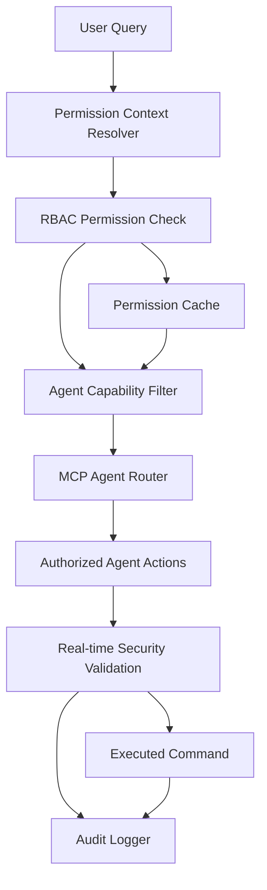

# Agent Architecture & MCP Integration

## 개요

A2A DevOps Platform의 핵심은 권한 기반 명령 조정과 확장 가능한 MCP (Model Context Protocol) agent 아키텍처입니다. 이 시스템은 사용자의 실제 Kubernetes RBAC 권한을 실시간으로 확인하고, 그에 따라 agent의 동작을 동적으로 조정합니다.

## 권한 기반 Agent 아키텍처

### 핵심 설계 원칙



### 권한 컨텍스트 해석기 (Permission Context Resolver)

```typescript
interface PermissionContext {
  user: UserIdentity;
  cluster: ClusterContext;
  namespace?: string;
  rbacRoles: K8sRole[];
  cloudPermissions: CloudPermission[];
  sessionContext: SessionContext;
  riskLevel: 'low' | 'medium' | 'high';
}

interface UserIdentity {
  id: string;
  authenticatedPlatforms: string[];
  k8sServiceAccount?: string;
  cloudIdentities: Map<string, CloudIdentity>;
  mfaVerified: boolean;
}

class PermissionContextResolver {
  async resolveContext(query: UserQuery): Promise<PermissionContext> {
    // 1. 사용자 신원 확인
    const userIdentity = await this.authenticateUser(query.sessionId);
    
    // 2. 대상 클러스터 컨텍스트 확인
    const clusterContext = await this.resolveClusterContext(query.target);
    
    // 3. Kubernetes RBAC 권한 실시간 조회
    const rbacRoles = await this.fetchK8sRBAC(userIdentity, clusterContext);
    
    // 4. 클라우드 프로바이더 권한 확인
    const cloudPermissions = await this.fetchCloudPermissions(userIdentity, clusterContext);
    
    // 5. 위험도 평가
    const riskLevel = this.assessRiskLevel(query, userIdentity, rbacRoles);
    
    return {
      user: userIdentity,
      cluster: clusterContext,
      rbacRoles,
      cloudPermissions,
      sessionContext: await this.getSessionContext(query.sessionId),
      riskLevel
    };
  }

  private async fetchK8sRBAC(user: UserIdentity, cluster: ClusterContext): Promise<K8sRole[]> {
    // kubectl auth whoami로 현재 사용자 확인
    const { stdout: userInfo } = await execAsync(`kubectl auth whoami --context=${cluster.context}`);
    
    // 사용자의 모든 권한 확인
    const permissions = await this.checkAllPermissions(cluster.context);
    
    // RoleBinding 및 ClusterRoleBinding 조회
    const roleBindings = await this.getUserRoleBindings(user, cluster);
    
    return this.parseRBACRoles(permissions, roleBindings);
  }

  private async checkAllPermissions(context: string): Promise<Permission[]> {
    const permissionChecks = [
      // Core API 권한
      'get pods', 'list pods', 'create pods', 'delete pods', 'update pods',
      'get services', 'list services', 'create services', 'delete services',
      'get deployments', 'list deployments', 'create deployments', 'delete deployments',
      'get secrets', 'list secrets', 'create secrets', 'delete secrets',
      
      // 고급 권한
      'get nodes', 'list nodes',
      'get clusterroles', 'list clusterroles',
      'get namespaces', 'list namespaces', 'create namespaces',
      
      // 보안 관련 권한
      'get networkpolicies', 'create networkpolicies',
      'get rolebindings', 'get clusterrolebindings',
      
      // 모니터링 권한
      'get events', 'list events'
    ];

    const results = await Promise.all(
      permissionChecks.map(async permission => ({
        action: permission,
        allowed: await this.testPermission(permission, context),
        resource: this.extractResource(permission),
        verb: this.extractVerb(permission)
      }))
    );

    return results.filter(r => r.allowed);
  }
}
```

## MCP Agent 권한 필터링 시스템

### Agent Capability Filter

```typescript
interface AgentCapability {
  name: string;
  requiredPermissions: Permission[];
  riskLevel: 'low' | 'medium' | 'high';
  alternatives?: AgentCapability[];
}

class AgentCapabilityFilter {
  private capabilities: Map<string, AgentCapability[]> = new Map();

  constructor() {
    this.initializeCapabilities();
  }

  async filterCapabilities(context: PermissionContext, requestedAction: string): Promise<FilteredCapabilities> {
    const agentType = this.determineAgentType(requestedAction);
    const availableCapabilities = this.capabilities.get(agentType) || [];
    
    const filteredCapabilities = await Promise.all(
      availableCapabilities.map(async capability => ({
        capability,
        allowed: await this.checkCapabilityPermissions(capability, context),
        alternatives: await this.findAlternatives(capability, context)
      }))
    );

    return {
      allowed: filteredCapabilities.filter(c => c.allowed),
      denied: filteredCapabilities.filter(c => !c.allowed),
      suggestions: this.generateSuggestions(filteredCapabilities, context)
    };
  }

  private initializeCapabilities(): void {
    // Kubernetes Agent Capabilities
    this.capabilities.set('kubernetes', [
      {
        name: 'list-pods',
        requiredPermissions: [{ verb: 'list', resource: 'pods' }],
        riskLevel: 'low'
      },
      {
        name: 'get-pod-details',
        requiredPermissions: [{ verb: 'get', resource: 'pods' }],
        riskLevel: 'low'
      },
      {
        name: 'create-deployment',
        requiredPermissions: [{ verb: 'create', resource: 'deployments' }],
        riskLevel: 'high',
        alternatives: [{
          name: 'view-deployment-template',
          requiredPermissions: [{ verb: 'get', resource: 'deployments' }],
          riskLevel: 'low'
        }]
      },
      {
        name: 'delete-resources',
        requiredPermissions: [{ verb: 'delete', resource: '*' }],
        riskLevel: 'high'
      },
      {
        name: 'access-secrets',
        requiredPermissions: [{ verb: 'get', resource: 'secrets' }],
        riskLevel: 'high'
      }
    ]);

    // Security Agent Capabilities (Falco)
    this.capabilities.set('security', [
      {
        name: 'view-security-events',
        requiredPermissions: [{ verb: 'get', resource: 'pods', namespace: 'falco-system' }],
        riskLevel: 'medium'
      },
      {
        name: 'modify-security-rules',
        requiredPermissions: [
          { verb: 'update', resource: 'configmaps', namespace: 'falco-system' },
          { verb: 'restart', resource: 'daemonsets', namespace: 'falco-system' }
        ],
        riskLevel: 'high'
      },
      {
        name: 'export-security-logs',
        requiredPermissions: [{ verb: 'get', resource: 'logs' }],
        riskLevel: 'medium'
      }
    ]);

    // Monitoring Agent Capabilities (Prometheus)
    this.capabilities.set('monitoring', [
      {
        name: 'query-metrics',
        requiredPermissions: [{ verb: 'proxy', resource: 'services', namespace: 'monitoring' }],
        riskLevel: 'low'
      },
      {
        name: 'modify-alerts',
        requiredPermissions: [
          { verb: 'update', resource: 'configmaps', namespace: 'monitoring' },
          { verb: 'update', resource: 'prometheusrules' }
        ],
        riskLevel: 'high'
      }
    ]);
  }

  private async checkCapabilityPermissions(capability: AgentCapability, context: PermissionContext): Promise<boolean> {
    // 모든 필요 권한이 있는지 확인
    for (const permission of capability.requiredPermissions) {
      const hasPermission = context.rbacRoles.some(role => 
        role.permissions.some(p => 
          p.verb === permission.verb && 
          (p.resource === permission.resource || p.resource === '*') &&
          (!permission.namespace || p.namespace === permission.namespace || p.namespace === '*')
        )
      );

      if (!hasPermission) {
        return false;
      }
    }

    // 위험도별 추가 검증
    if (capability.riskLevel === 'high') {
      return await this.validateHighRiskOperation(capability, context);
    }

    return true;
  }

  private async validateHighRiskOperation(capability: AgentCapability, context: PermissionContext): Promise<boolean> {
    // MFA 검증 (고위험 작업의 경우)
    if (!context.user.mfaVerified && capability.riskLevel === 'high') {
      throw new MFARequiredError(`MFA required for ${capability.name}`);
    }

    // 프로덕션 환경 추가 검증
    if (context.cluster.environment === 'production' && capability.riskLevel === 'high') {
      return await this.requestProductionApproval(capability, context);
    }

    return true;
  }
}
```

## 동적 Agent 라우팅 및 실행

### Permission-Aware MCP Agent Router

```typescript
class MCPAgentRouter {
  private agents: Map<string, MCPAgent> = new Map();
  private permissionFilter: AgentCapabilityFilter;
  private auditLogger: AuditLogger;

  async routeQuery(query: UserQuery, context: PermissionContext): Promise<AgentResponse> {
    // 1. 쿼리 분석 및 agent 타입 결정
    const agentType = await this.analyzeQueryType(query);
    
    // 2. 권한 기반 capability 필터링
    const filteredCapabilities = await this.permissionFilter.filterCapabilities(context, query.text);
    
    // 3. 적절한 agent 선택 및 capability 제한
    const agent = await this.selectAndConfigureAgent(agentType, filteredCapabilities, context);
    
    // 4. 권한이 제한된 agent 실행
    const response = await this.executeWithPermissionGuard(agent, query, context);
    
    // 5. 응답 후처리 및 감사 로깅
    await this.postProcessResponse(response, context);
    
    return response;
  }

  private async selectAndConfigureAgent(
    agentType: string, 
    capabilities: FilteredCapabilities,
    context: PermissionContext
  ): Promise<MCPAgent> {
    const baseAgent = this.agents.get(agentType);
    if (!baseAgent) {
      throw new Error(`Agent type ${agentType} not found`);
    }

    // Agent를 사용자 권한에 맞게 구성
    const configuredAgent = baseAgent.clone();
    
    // 허용된 capabilities만 활성화
    configuredAgent.enabledCapabilities = capabilities.allowed.map(c => c.capability.name);
    
    // 권한 컨텍스트 주입
    configuredAgent.permissionContext = context;
    
    // 대안 제안 설정
    configuredAgent.alternatives = capabilities.suggestions;

    return configuredAgent;
  }

  private async executeWithPermissionGuard(
    agent: MCPAgent, 
    query: UserQuery, 
    context: PermissionContext
  ): Promise<AgentResponse> {
    // 실행 전 최종 권한 검증
    await this.validateExecutionPermissions(agent, query, context);
    
    // 권한 가드와 함께 agent 실행
    const guardedExecution = new PermissionGuardedExecution(agent, context);
    
    try {
      const response = await guardedExecution.execute(query);
      
      // 응답에 권한 정보 추가
      response.metadata = {
        ...response.metadata,
        permissionLevel: this.calculatePermissionLevel(context),
        restrictedActions: guardedExecution.getRestrictedActions(),
        availableAlternatives: agent.alternatives
      };

      return response;
    } catch (error) {
      // 권한 관련 에러 처리
      if (error instanceof PermissionDeniedError) {
        return this.generatePermissionDeniedResponse(error, agent.alternatives);
      }
      throw error;
    }
  }
}
```

## 실시간 보안 처리 및 명령 조정

### Permission Guarded Execution

```typescript
class PermissionGuardedExecution {
  private agent: MCPAgent;
  private context: PermissionContext;
  private restrictedActions: string[] = [];

  constructor(agent: MCPAgent, context: PermissionContext) {
    this.agent = agent;
    this.context = context;
  }

  async execute(query: UserQuery): Promise<AgentResponse> {
    // Agent 실행 과정에서 실시간 권한 검증
    const originalExecute = this.agent.execute.bind(this.agent);
    
    this.agent.execute = async (command: AgentCommand) => {
      // 명령 실행 전 권한 재검증
      await this.validateCommandPermission(command);
      
      // 명령 조정 (권한에 따라)
      const adjustedCommand = await this.adjustCommandForPermissions(command);
      
      // 실제 실행
      const result = await originalExecute(adjustedCommand);
      
      // 결과 필터링 (민감한 정보 제거)
      return await this.filterSensitiveData(result, command);
    };

    return await this.agent.execute(query);
  }

  private async validateCommandPermission(command: AgentCommand): Promise<void> {
    const requiredPermissions = this.getRequiredPermissions(command);
    
    for (const permission of requiredPermissions) {
      if (!this.hasPermission(permission)) {
        this.restrictedActions.push(command.action);
        throw new PermissionDeniedError(
          `Insufficient permissions for ${command.action}`,
          permission,
          this.suggestAlternative(command)
        );
      }
    }
  }

  private async adjustCommandForPermissions(command: AgentCommand): Promise<AgentCommand> {
    const adjustedCommand = { ...command };

    // 네임스페이스 제한
    if (this.isNamespaceRestricted()) {
      adjustedCommand.namespace = this.getAllowedNamespaces();
    }

    // 리소스 타입 제한
    if (this.hasLimitedResourceAccess()) {
      adjustedCommand.resources = this.filterAllowedResources(command.resources);
    }

    // Secret 접근 제한
    if (command.includesSecrets && !this.canAccessSecrets()) {
      adjustedCommand.includesSecrets = false;
      adjustedCommand.alternatives.push({
        action: 'list-secret-names',
        description: 'Show secret names only (values hidden due to permissions)'
      });
    }

    // 수정 작업 제한
    if (command.isModifyOperation && !this.canModifyResources()) {
      adjustedCommand.dryRun = true;
      adjustedCommand.explanation = 'Showing what would be done (dry-run due to read-only permissions)';
    }

    return adjustedCommand;
  }

  private async filterSensitiveData(result: any, command: AgentCommand): Promise<any> {
    if (!this.canViewSensitiveData()) {
      // Secret 값 마스킹
      result = this.maskSecretValues(result);
      
      // 환경 변수 필터링
      result = this.filterEnvironmentVariables(result);
      
      // 네트워크 정보 제한
      result = this.limitNetworkInformation(result);
    }

    // 네임스페이스 기반 필터링
    if (this.isNamespaceRestricted()) {
      result = this.filterByAllowedNamespaces(result);
    }

    return result;
  }
}
```

## 확장 가능한 Agent 플러그인 시스템

### Agent Plugin Architecture

```typescript
interface AgentPlugin {
  name: string;
  version: string;
  requiredPermissions: Permission[];
  capabilities: string[];
  
  initialize(context: PermissionContext): Promise<void>;
  canExecute(command: AgentCommand, context: PermissionContext): Promise<boolean>;
  execute(command: AgentCommand, context: PermissionContext): Promise<PluginResult>;
  cleanup(): Promise<void>;
}

class ExtendableAgentSystem {
  private plugins: Map<string, AgentPlugin> = new Map();
  private permissionValidator: PermissionValidator;

  async registerPlugin(plugin: AgentPlugin): Promise<void> {
    // 플러그인 권한 요구사항 검증
    await this.validatePluginPermissions(plugin);
    
    // 플러그인 보안 스캔
    await this.securityScanPlugin(plugin);
    
    // 플러그인 등록
    this.plugins.set(plugin.name, plugin);
  }

  async executePluginCommand(
    pluginName: string, 
    command: AgentCommand, 
    context: PermissionContext
  ): Promise<PluginResult> {
    const plugin = this.plugins.get(pluginName);
    if (!plugin) {
      throw new Error(`Plugin ${pluginName} not found`);
    }

    // 플러그인별 권한 검증
    const canExecute = await plugin.canExecute(command, context);
    if (!canExecute) {
      throw new PermissionDeniedError(`Plugin ${pluginName} execution denied`);
    }

    // 권한이 제한된 실행 컨텍스트 생성
    const restrictedContext = await this.createRestrictedContext(context, plugin);
    
    // 플러그인 실행
    return await plugin.execute(command, restrictedContext);
  }

  // 예시: 커스텀 보안 정책 플러그인
  async registerSecurityPolicyPlugin(): Promise<void> {
    const securityPlugin: AgentPlugin = {
      name: 'custom-security-policy',
      version: '1.0.0',
      requiredPermissions: [
        { verb: 'get', resource: 'networkpolicies' },
        { verb: 'list', resource: 'podsecuritypolicies' }
      ],
      capabilities: ['analyze-security-posture', 'recommend-policies'],
      
      async initialize(context: PermissionContext): Promise<void> {
        // 보안 정책 데이터베이스 초기화
      },

      async canExecute(command: AgentCommand, context: PermissionContext): Promise<boolean> {
        return context.rbacRoles.some(role => 
          role.permissions.some(p => p.verb === 'get' && p.resource === 'networkpolicies')
        );
      },

      async execute(command: AgentCommand, context: PermissionContext): Promise<PluginResult> {
        // 커스텀 보안 분석 로직
        const securityAnalysis = await this.analyzeClusterSecurity(context.cluster);
        
        return {
          success: true,
          data: securityAnalysis,
          recommendations: this.generateSecurityRecommendations(securityAnalysis)
        };
      },

      async cleanup(): Promise<void> {
        // 리소스 정리
      }
    };

    await this.registerPlugin(securityPlugin);
  }
}
```

## 실제 구현 예시

### 권한 기반 Kubernetes Agent

```typescript
class KubernetesAgent extends MCPAgent {
  async handlePodListQuery(query: UserQuery, context: PermissionContext): Promise<AgentResponse> {
    // 1. 네임스페이스 권한 확인
    const allowedNamespaces = await this.getAllowedNamespaces(context);
    
    if (allowedNamespaces.length === 0) {
      return {
        success: false,
        error: 'No namespace access permissions',
        alternatives: [
          'Request access to specific namespaces from your administrator',
          'Check your current permissions: a2a auth permissions'
        ]
      };
    }

    // 2. 권한에 따른 명령 조정
    const pods = await Promise.all(
      allowedNamespaces.map(async namespace => {
        try {
          const podList = await this.listPods(namespace, context);
          
          // 3. 민감한 정보 필터링
          return this.filterPodSensitiveData(podList, context);
        } catch (error) {
          // 네임스페이스별 에러 처리
          return {
            namespace,
            error: error.message,
            pods: []
          };
        }
      })
    );

    return {
      success: true,
      data: pods.filter(p => p.pods && p.pods.length > 0),
      metadata: {
        accessLevel: this.calculateAccessLevel(context),
        restrictedNamespaces: this.getRestrictedNamespaces(context),
        availableActions: this.getAvailableActions(context)
      }
    };
  }

  private async filterPodSensitiveData(pods: K8sPod[], context: PermissionContext): Promise<K8sPod[]> {
    return pods.map(pod => {
      const filteredPod = { ...pod };

      // Secret 볼륨 정보 제한
      if (!this.canViewSecrets(context)) {
        filteredPod.spec.volumes = pod.spec.volumes?.map(volume => ({
          ...volume,
          secret: volume.secret ? { name: '[HIDDEN]' } : volume.secret
        }));
      }

      // 환경 변수 필터링
      if (!this.canViewEnvironmentVariables(context)) {
        filteredPod.spec.containers = pod.spec.containers.map(container => ({
          ...container,
          env: container.env?.map(env => ({
            name: env.name,
            value: env.valueFrom ? '[HIDDEN]' : env.value
          }))
        }));
      }

      return filteredPod;
    });
  }
}
```

이러한 아키텍처를 통해:

1. **세밀한 권한 제어**: 실제 Kubernetes RBAC과 연동하여 사용자별로 다른 agent 동작
2. **실시간 보안 검증**: 모든 명령 실행 시점에서 권한 재검증
3. **확장 가능한 플러그인**: 새로운 agent나 기능을 권한 시스템과 통합하여 추가
4. **투명한 제한 사항**: 사용자에게 왜 특정 작업이 제한되는지 명확한 설명 제공
5. **대안 제시**: 권한이 부족한 경우 가능한 대안 작업 제안

이를 통해 enterprise 환경에서 안전하면서도 유용한 AI 기반 DevOps 플랫폼을 구축할 수 있습니다.