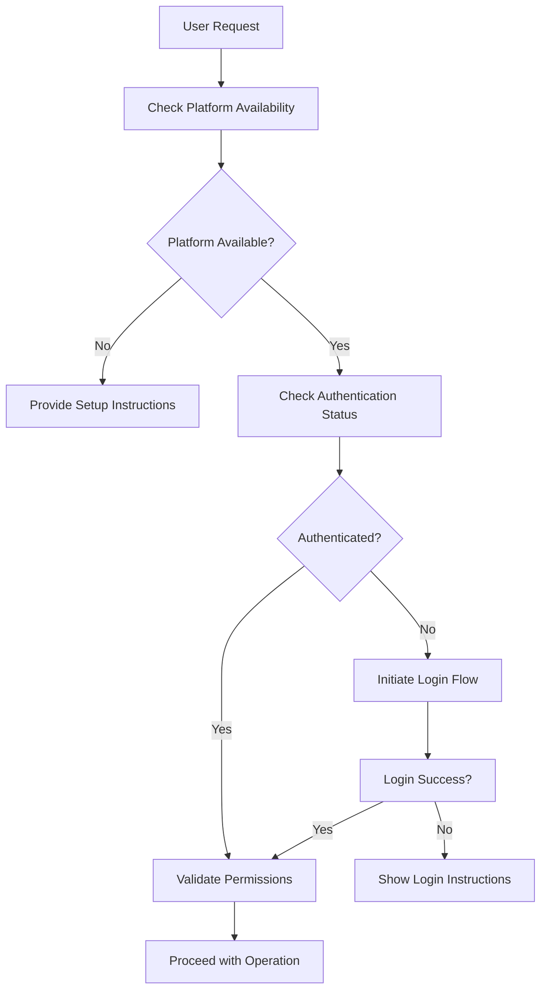

# Kubernetes Connection System Documentation

## Overview

The Kubernetes Connection System is the foundational component of the A2A DevOps Platform, responsible for automatically discovering, authenticating with, and managing connections to Kubernetes clusters across multiple cloud providers and local environments.

## Architecture

### Core Components

```
├── ConnectionManager.ts        # Central connection orchestrator
├── discovery/
│   ├── DiscoveryEngine.ts     # Main discovery coordinator
│   ├── AWSEKSDiscovery.ts     # AWS EKS cluster discovery
│   ├── GCPGKEDiscovery.ts     # GCP GKE cluster discovery
│   ├── AzureAKSDiscovery.ts   # Azure AKS cluster discovery
│   └── LocalDiscovery.ts      # Local cluster discovery (minikube, k3s, etc.)
├── auth/
│   ├── AuthenticationManager.ts # Authentication coordinator
│   ├── AWSAuthProvider.ts      # AWS IAM authentication
│   ├── GCPAuthProvider.ts      # GCP service account authentication
│   ├── AzureAuthProvider.ts    # Azure AD authentication
│   └── KubeconfigManager.ts    # kubeconfig file management
└── setup/
    ├── ClusterSetupManager.ts  # Automated cluster setup
    ├── EKSConfigurator.ts      # EKS-specific configuration
    ├── GKEConfigurator.ts      # GKE-specific configuration
    └── AKSConfigurator.ts      # AKS-specific configuration
```

## Cluster Discovery

### Discovery Process

1. **Platform Detection**: Automatically detect available cloud CLIs and authentication status
2. **Cluster Enumeration**: Query each platform for available clusters
3. **Access Validation**: Test connectivity and permissions for each discovered cluster
4. **Configuration Status**: Check if cluster is already configured in kubeconfig

### Implementation Details

#### AWS EKS Discovery

```typescript
interface EKSCluster {
  name: string;
  region: string;
  status: 'ACTIVE' | 'CREATING' | 'DELETING' | 'FAILED';
  endpoint: string;
  version: string;
  platformVersion: string;
  roleArn?: string;
  vpcConfig: {
    subnetIds: string[];
    securityGroupIds: string[];
    endpointAccess: 'public' | 'private' | 'public_and_private';
  };
}

class AWSEKSDiscovery implements ClusterDiscoverer {
  async isAvailable(): Promise<boolean> {
    // Check if AWS CLI is installed and configured
    try {
      await execAsync('aws sts get-caller-identity');
      return true;
    } catch {
      return false;
    }
  }

  async discoverClusters(): Promise<ClusterInfo[]> {
    const regions = await this.getAvailableRegions();
    const clusters: ClusterInfo[] = [];
    
    for (const region of regions) {
      try {
        const { stdout } = await execAsync(`aws eks list-clusters --region ${region} --output json`);
        const response = JSON.parse(stdout);
        
        for (const clusterName of response.clusters) {
          const clusterDetails = await this.getClusterDetails(clusterName, region);
          clusters.push(this.convertToClusterInfo(clusterDetails, region));
        }
      } catch (error) {
        // Log error but continue with other regions
        console.warn(`Failed to discover EKS clusters in region ${region}:`, error);
      }
    }
    
    return clusters;
  }

  private async getClusterDetails(name: string, region: string): Promise<EKSCluster> {
    const { stdout } = await execAsync(`aws eks describe-cluster --name ${name} --region ${region} --output json`);
    const response = JSON.parse(stdout);
    return response.cluster;
  }
}
```

#### GCP GKE Discovery

```typescript
class GCPGKEDiscovery implements ClusterDiscoverer {
  async isAvailable(): Promise<boolean> {
    try {
      await execAsync('gcloud auth list --filter=status:ACTIVE --format="value(account)" | head -1');
      return true;
    } catch {
      return false;
    }
  }

  async discoverClusters(): Promise<ClusterInfo[]> {
    try {
      const { stdout } = await execAsync('gcloud container clusters list --format=json');
      const gkeClusters = JSON.parse(stdout);
      
      return gkeClusters.map((cluster: any) => ({
        id: `gke-${cluster.name}-${cluster.zone || cluster.location}`,
        name: cluster.name,
        platform: 'gcp-gke' as const,
        region: cluster.zone || cluster.location,
        status: cluster.status === 'RUNNING' ? 'active' : 'inactive',
        nodeCount: cluster.currentNodeCount,
        kubernetesVersion: cluster.currentMasterVersion,
        endpoint: cluster.endpoint,
        isConfigured: await this.isConfiguredInKubeconfig(cluster.name, cluster.zone || cluster.location),
        lastAccessed: await this.getLastAccessTime(cluster.name)
      }));
    } catch (error) {
      throw new Error(`Failed to discover GKE clusters: ${error}`);
    }
  }
}
```

#### Azure AKS Discovery

```typescript
class AzureAKSDiscovery implements ClusterDiscoverer {
  async isAvailable(): Promise<boolean> {
    try {
      await execAsync('az account show');
      return true;
    } catch {
      return false;
    }
  }

  async discoverClusters(): Promise<ClusterInfo[]> {
    try {
      const { stdout } = await execAsync('az aks list --output json');
      const aksClusters = JSON.parse(stdout);
      
      return aksClusters.map((cluster: any) => ({
        id: `aks-${cluster.name}-${cluster.resourceGroup}`,
        name: cluster.name,
        platform: 'azure-aks' as const,
        region: cluster.location,
        status: cluster.powerState?.code === 'Running' ? 'active' : 'inactive',
        nodeCount: cluster.agentPoolProfiles?.reduce((sum: number, pool: any) => sum + pool.count, 0) || 0,
        kubernetesVersion: cluster.kubernetesVersion,
        endpoint: cluster.fqdn,
        isConfigured: await this.isConfiguredInKubeconfig(cluster.name, cluster.resourceGroup),
        lastAccessed: await this.getLastAccessTime(cluster.name)
      }));
    } catch (error) {
      throw new Error(`Failed to discover AKS clusters: ${error}`);
    }
  }
}
```

## Authentication Management

### Authentication Flow



### AWS Authentication

```typescript
class AWSAuthProvider implements AuthProvider {
  async isAuthenticated(): Promise<boolean> {
    try {
      const { stdout } = await execAsync('aws sts get-caller-identity --output json');
      const identity = JSON.parse(stdout);
      return !!identity.Account;
    } catch {
      return false;
    }
  }

  async validatePermissions(cluster: ClusterInfo): Promise<PermissionResult> {
    const requiredPermissions = [
      'eks:DescribeCluster',
      'eks:ListClusters',
      'eks:AccessKubernetesApi'
    ];

    const permissions: string[] = [];
    const missingPermissions: string[] = [];

    for (const permission of requiredPermissions) {
      try {
        // Simulate permission check - in reality, this would use AWS policy simulator
        await execAsync(`aws iam simulate-principal-policy --policy-source-arn $(aws sts get-caller-identity --query Arn --output text) --action-names ${permission} --resource-arns "*"`);
        permissions.push(permission);
      } catch {
        missingPermissions.push(permission);
      }
    }

    return {
      canConnect: missingPermissions.length === 0,
      permissions,
      missingPermissions,
      suggestedActions: missingPermissions.length > 0 ? [
        'Check IAM permissions for EKS access',
        'Contact your AWS administrator',
        'Review EKS cluster resource policies'
      ] : []
    };
  }
}
```

## Cluster Configuration

### Automatic Setup Process

1. **Prerequisite Validation**: Ensure required CLIs are installed
2. **Authentication Verification**: Confirm platform authentication
3. **Kubeconfig Generation**: Generate or update kubeconfig entries
4. **Context Management**: Handle naming conflicts and context switching
5. **Connection Testing**: Verify successful cluster connectivity

### Implementation

```typescript
class ClusterSetupManager {
  private configurators: Map<string, ClusterConfigurator> = new Map();

  constructor() {
    this.configurators.set('aws-eks', new EKSConfigurator());
    this.configurators.set('gcp-gke', new GKEConfigurator());
    this.configurators.set('azure-aks', new AKSConfigurator());
  }

  async setupCluster(cluster: ClusterInfo): Promise<SetupResult> {
    const configurator = this.configurators.get(cluster.platform);
    if (!configurator) {
      throw new Error(`Unsupported platform: ${cluster.platform}`);
    }

    // Pre-setup validation
    const validationResult = await this.validatePrerequisites(cluster.platform);
    if (!validationResult.success) {
      return {
        success: false,
        contextName: '',
        configPath: '',
        errors: validationResult.errors,
        warnings: []
      };
    }

    // Execute platform-specific setup
    return await configurator.setupKubeconfig(cluster);
  }

  private async validatePrerequisites(platform: string): Promise<{ success: boolean; errors: string[] }> {
    const errors: string[] = [];

    // Check kubectl installation
    try {
      await execAsync('kubectl version --client');
    } catch {
      errors.push('kubectl is not installed or not in PATH');
    }

    // Platform-specific checks
    switch (platform) {
      case 'aws-eks':
        try {
          await execAsync('aws --version');
        } catch {
          errors.push('AWS CLI is not installed');
        }
        break;
      case 'gcp-gke':
        try {
          await execAsync('gcloud version');
        } catch {
          errors.push('Google Cloud SDK is not installed');
        }
        break;
      case 'azure-aks':
        try {
          await execAsync('az version');
        } catch {
          errors.push('Azure CLI is not installed');
        }
        break;
    }

    return { success: errors.length === 0, errors };
  }
}
```

## Error Handling and Recovery

### Common Connection Issues

1. **Missing CLI Tools**: Automatic detection and installation guidance
2. **Authentication Failures**: Step-by-step authentication instructions
3. **Network Connectivity**: Proxy configuration and firewall troubleshooting
4. **Permission Errors**: RBAC analysis and permission recommendations

### Error Categories

```typescript
enum ConnectionErrorType {
  MISSING_PREREQUISITES = 'missing_prerequisites',
  AUTHENTICATION_FAILED = 'authentication_failed',
  NETWORK_UNREACHABLE = 'network_unreachable',
  PERMISSION_DENIED = 'permission_denied',
  CLUSTER_UNREACHABLE = 'cluster_unreachable',
  CONFIGURATION_INVALID = 'configuration_invalid'
}

interface ConnectionError {
  type: ConnectionErrorType;
  message: string;
  details?: any;
  suggestions: string[];
  automatedFix?: () => Promise<boolean>;
}
```

## Performance Considerations

### Optimization Strategies

1. **Parallel Discovery**: Discover clusters across platforms concurrently
2. **Caching**: Cache cluster information with TTL
3. **Lazy Loading**: Load detailed cluster information on demand
4. **Connection Pooling**: Reuse authenticated connections where possible

### Monitoring and Metrics

- Discovery operation latency
- Authentication success rates
- Connection establishment time
- Error rates by platform and error type

## Testing Strategy

### Unit Tests
- Mock cloud provider APIs
- Test authentication flows
- Validate error handling

### Integration Tests
- Test against real cloud environments
- Validate end-to-end cluster setup
- Test permission edge cases

### Performance Tests
- Measure discovery time across multiple clusters
- Test concurrent connection establishment
- Validate resource usage under load

## Future Enhancements

1. **Additional Platforms**: OpenShift, Rancher, Digital Ocean Kubernetes
2. **Advanced Authentication**: SSO integration, certificate-based auth
3. **Cluster Templating**: Save and replay cluster configurations
4. **Health Monitoring**: Continuous cluster health assessment
5. **Cost Optimization**: Cluster utilization and cost analysis integration

---

**Status**: ✅ **Foundation Complete** - Core discovery and authentication framework implemented  
**Priority**: P0 (Blocking) - All other features depend on this system  
**Owner**: DevOps Platform Team  
**Last Updated**: January 2025