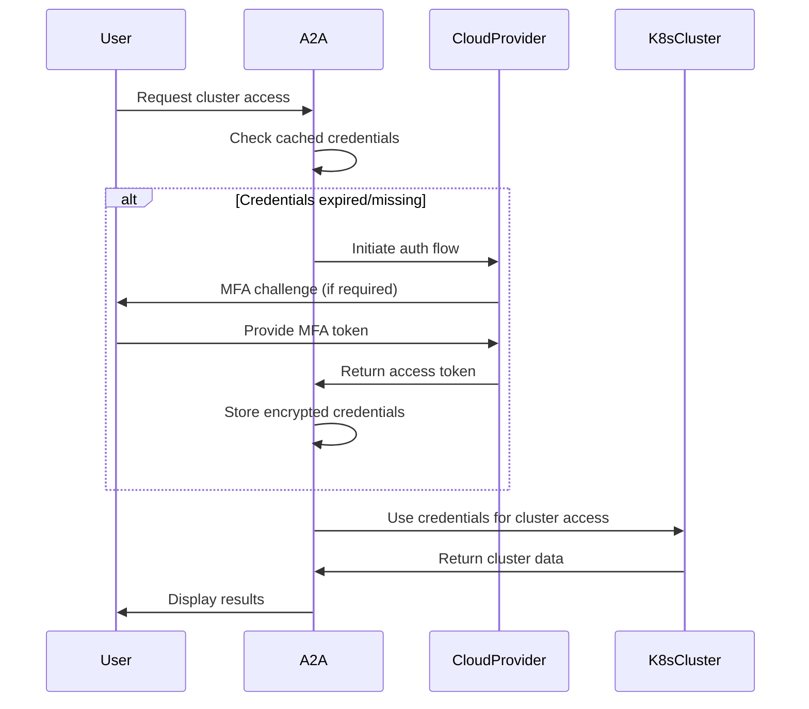

# Security & Authentication Documentation

## Overview

The Security & Authentication system provides comprehensive credential management, access control, and audit capabilities for the A2A DevOps Platform across multiple cloud providers and Kubernetes environments.

## Security Architecture

### Core Security Principles

1. **Zero Trust Architecture**: Never trust, always verify
2. **Principle of Least Privilege**: Minimum required permissions only
3. **Defense in Depth**: Multiple layers of security controls
4. **Audit Everything**: Complete trail of all access and operations
5. **Secure by Default**: All configurations default to most secure options

### Security Components

```
├── security/
│   ├── SecurityManager.ts         # Central security coordinator
│   ├── AccessControl.ts           # Permission and RBAC management  
│   ├── CredentialManager.ts       # Secure credential storage
│   ├── AuditLogger.ts            # Security event logging
│   ├── SessionManager.ts         # Session lifecycle management
│   └── PolicyEngine.ts           # Security policy enforcement
├── auth/
│   ├── AuthenticationManager.ts  # Multi-platform authentication
│   ├── TokenManager.ts           # Dynamic token management
│   ├── MFAProvider.ts            # Multi-factor authentication
│   └── providers/
│       ├── AWSAuthProvider.ts    # AWS IAM integration
│       ├── GCPAuthProvider.ts    # GCP IAM integration
│       ├── AzureAuthProvider.ts  # Azure AD integration
│       └── OIDCProvider.ts       # Generic OIDC integration
└── encryption/
    ├── CredentialEncryption.ts   # At-rest encryption
    ├── CertificateManager.ts     # TLS certificate management
    └── KeyRotation.ts            # Automatic key rotation
```

## Authentication Framework

### Multi-Platform Authentication Flow



### Authentication Providers

#### AWS IAM Authentication

```typescript
class AWSAuthProvider implements AuthProvider {
  private readonly platform = 'aws';
  private credentialManager: CredentialManager;
  private sessionManager: SessionManager;

  async authenticate(): Promise<AuthResult> {
    // Check existing credentials
    const existingCreds = await this.credentialManager.getCredentials(this.platform);
    if (existingCreds && !this.isExpired(existingCreds)) {
      return { success: true, credentials: existingCreds };
    }

    // Attempt various authentication methods
    const authMethods = [
      this.tryEnvironmentCredentials,
      this.tryProfileCredentials,
      this.tryInstanceProfile,
      this.tryInteractiveLogin
    ];

    for (const method of authMethods) {
      try {
        const result = await method.call(this);
        if (result.success) {
          await this.credentialManager.storeCredentials(this.platform, result.credentials);
          return result;
        }
      } catch (error) {
        // Log error and continue to next method
        await this.auditLogger.logAuthAttempt({
          platform: this.platform,
          method: method.name,
          success: false,
          error: error.message
        });
      }
    }

    return { success: false, error: 'All authentication methods failed' };
  }

  private async tryEnvironmentCredentials(): Promise<AuthResult> {
    const accessKey = process.env.AWS_ACCESS_KEY_ID;
    const secretKey = process.env.AWS_SECRET_ACCESS_KEY;
    const sessionToken = process.env.AWS_SESSION_TOKEN;

    if (!accessKey || !secretKey) {
      throw new Error('AWS environment credentials not found');
    }

    // Validate credentials
    try {
      const { stdout } = await execAsync('aws sts get-caller-identity');
      const identity = JSON.parse(stdout);
      
      return {
        success: true,
        credentials: {
          accessKeyId: accessKey,
          secretAccessKey: secretKey,
          sessionToken,
          identity,
          source: 'environment',
          expiresAt: sessionToken ? this.getTokenExpiry(sessionToken) : undefined
        }
      };
    } catch (error) {
      throw new Error(`Invalid AWS credentials: ${error.message}`);
    }
  }

  private async tryProfileCredentials(): Promise<AuthResult> {
    try {
      // Try default profile first
      const { stdout } = await execAsync('aws sts get-caller-identity');
      const identity = JSON.parse(stdout);
      
      return {
        success: true,
        credentials: {
          identity,
          source: 'profile',
          profile: process.env.AWS_PROFILE || 'default'
        }
      };
    } catch (error) {
      throw new Error(`AWS profile authentication failed: ${error.message}`);
    }
  }

  async validatePermissions(cluster: ClusterInfo): Promise<PermissionResult> {
    const requiredActions = [
      'eks:DescribeCluster',
      'eks:ListClusters',
      'eks:AccessKubernetesApi'
    ];

    const simulationResults = await this.simulatePermissions(requiredActions, cluster);
    
    return {
      canConnect: simulationResults.every(r => r.allowed),
      permissions: simulationResults.filter(r => r.allowed).map(r => r.action),
      missingPermissions: simulationResults.filter(r => !r.allowed).map(r => r.action),
      suggestedActions: this.generatePermissionSuggestions(simulationResults)
    };
  }

  private async simulatePermissions(actions: string[], cluster: ClusterInfo): Promise<PermissionSimulation[]> {
    const clusterArn = `arn:aws:eks:${cluster.region}:*:cluster/${cluster.name}`;
    
    try {
      const { stdout } = await execAsync(`aws iam simulate-principal-policy \
        --policy-source-arn $(aws sts get-caller-identity --query Arn --output text) \
        --action-names ${actions.join(' ')} \
        --resource-arns "${clusterArn}" \
        --output json`);
      
      return JSON.parse(stdout).EvaluationResults.map((result: any) => ({
        action: result.EvalActionName,
        allowed: result.EvalDecision === 'allowed',
        resource: result.EvalResourceName
      }));
    } catch (error) {
      // Fallback to basic permission check
      return actions.map(action => ({
        action,
        allowed: false,
        error: 'Permission simulation failed'
      }));
    }
  }
}
```

#### GCP Service Account Authentication

```typescript
class GCPAuthProvider implements AuthProvider {
  private readonly platform = 'gcp';

  async authenticate(): Promise<AuthResult> {
    // Check Application Default Credentials (ADC)
    try {
      const { stdout } = await execAsync('gcloud auth application-default print-access-token');
      const accessToken = stdout.trim();
      
      if (accessToken) {
        const identity = await this.getServiceAccountInfo();
        return {
          success: true,
          credentials: {
            accessToken,
            identity,
            source: 'application-default',
            expiresAt: await this.getTokenExpiry(accessToken)
          }
        };
      }
    } catch (error) {
      // ADC not available, try user credentials
    }

    // Check user credentials
    try {
      const { stdout: activeAccount } = await execAsync('gcloud auth list --filter=status:ACTIVE --format="value(account)" | head -1');
      if (activeAccount.trim()) {
        const { stdout: accessToken } = await execAsync('gcloud auth print-access-token');
        
        return {
          success: true,
          credentials: {
            accessToken: accessToken.trim(),
            account: activeAccount.trim(),
            source: 'user-account',
            expiresAt: await this.getTokenExpiry(accessToken.trim())
          }
        };
      }
    } catch (error) {
      throw new Error(`GCP authentication failed: ${error.message}`);
    }

    throw new Error('No valid GCP credentials found');
  }

  async validatePermissions(cluster: ClusterInfo): Promise<PermissionResult> {
    const requiredPermissions = [
      'container.clusters.get',
      'container.clusters.list',
      'container.clusters.getCredentials'
    ];

    const testResults = await Promise.all(
      requiredPermissions.map(permission => this.testPermission(permission, cluster))
    );

    const grantedPermissions = testResults.filter(r => r.granted).map(r => r.permission);
    const deniedPermissions = testResults.filter(r => !r.granted).map(r => r.permission);

    return {
      canConnect: deniedPermissions.length === 0,
      permissions: grantedPermissions,
      missingPermissions: deniedPermissions,
      suggestedActions: deniedPermissions.length > 0 ? [
        'Check Google Cloud IAM permissions',
        'Ensure service account has Kubernetes Engine permissions',
        'Contact your Google Cloud administrator'
      ] : []
    };
  }

  private async testPermission(permission: string, cluster: ClusterInfo): Promise<{ permission: string; granted: boolean }> {
    try {
      const resourceName = `projects/${cluster.projectId}/zones/${cluster.region}/clusters/${cluster.name}`;
      
      const { stdout } = await execAsync(`gcloud projects test-iam-permissions ${cluster.projectId} \
        --permissions=${permission} \
        --format="value(permissions)" 2>/dev/null`);
      
      return {
        permission,
        granted: stdout.includes(permission)
      };
    } catch {
      return { permission, granted: false };
    }
  }
}
```

## Credential Management

### Secure Storage

```typescript
class CredentialManager {
  private encryptionKey: Buffer;
  private storage: SecureStorage;

  constructor() {
    this.encryptionKey = this.deriveEncryptionKey();
    this.storage = new SecureStorage();
  }

  async storeCredentials(platform: string, credentials: any): Promise<void> {
    // Encrypt sensitive data
    const encryptedCredentials = await this.encrypt(credentials);
    
    // Store with metadata
    const credentialEntry = {
      platform,
      credentials: encryptedCredentials,
      createdAt: new Date(),
      lastUsed: new Date(),
      expiresAt: credentials.expiresAt,
      source: credentials.source
    };

    await this.storage.store(`credentials:${platform}`, credentialEntry);
    
    // Log storage event
    await this.auditLogger.logCredentialEvent({
      action: 'store',
      platform,
      source: credentials.source,
      timestamp: new Date()
    });
  }

  async getCredentials(platform: string): Promise<any | null> {
    const entry = await this.storage.retrieve(`credentials:${platform}`);
    if (!entry) return null;

    // Check expiration
    if (entry.expiresAt && new Date() > new Date(entry.expiresAt)) {
      await this.removeCredentials(platform);
      return null;
    }

    // Decrypt and return
    const decryptedCredentials = await this.decrypt(entry.credentials);
    
    // Update last used timestamp
    entry.lastUsed = new Date();
    await this.storage.store(`credentials:${platform}`, entry);

    return decryptedCredentials;
  }

  async removeCredentials(platform: string): Promise<void> {
    await this.storage.delete(`credentials:${platform}`);
    
    await this.auditLogger.logCredentialEvent({
      action: 'remove',
      platform,
      timestamp: new Date()
    });
  }

  private async encrypt(data: any): Promise<string> {
    const cipher = crypto.createCipher('aes-256-gcm', this.encryptionKey);
    const encrypted = Buffer.concat([
      cipher.update(JSON.stringify(data), 'utf8'),
      cipher.final()
    ]);
    
    const authTag = cipher.getAuthTag();
    return Buffer.concat([encrypted, authTag]).toString('base64');
  }

  private async decrypt(encryptedData: string): Promise<any> {
    const buffer = Buffer.from(encryptedData, 'base64');
    const encrypted = buffer.slice(0, -16);
    const authTag = buffer.slice(-16);
    
    const decipher = crypto.createDecipher('aes-256-gcm', this.encryptionKey);
    decipher.setAuthTag(authTag);
    
    const decrypted = Buffer.concat([
      decipher.update(encrypted),
      decipher.final()
    ]);
    
    return JSON.parse(decrypted.toString('utf8'));
  }
}
```

## Access Control & RBAC

### Permission Framework

```typescript
interface AccessPolicy {
  subject: string;          // User/service account identifier
  resource: string;         // Cluster/namespace/resource pattern
  actions: string[];        // Allowed operations
  conditions?: Condition[]; // Additional constraints
  effect: 'Allow' | 'Deny';
}

interface Condition {
  type: 'time' | 'ip' | 'mfa' | 'custom';
  operator: 'equals' | 'contains' | 'matches' | 'between';
  value: any;
}

class AccessControl {
  private policies: AccessPolicy[] = [];
  private roleBindings: Map<string, string[]> = new Map();

  async validateAccess(request: AccessRequest): Promise<AccessResult> {
    // 1. Authentication check
    if (!request.user.authenticated) {
      return { allowed: false, reason: 'User not authenticated' };
    }

    // 2. Session validation
    if (await this.isSessionExpired(request.user.sessionId)) {
      return { allowed: false, reason: 'Session expired' };
    }

    // 3. Policy evaluation
    const applicablePolicies = this.findApplicablePolicies(request);
    const evaluationResult = await this.evaluatePolicies(applicablePolicies, request);

    // 4. MFA check for sensitive operations
    if (this.requiresMFA(request) && !request.user.mfaVerified) {
      return { 
        allowed: false, 
        reason: 'MFA required',
        nextStep: 'mfa_challenge'
      };
    }

    // 5. Audit logging
    await this.auditLogger.logAccessAttempt({
      user: request.user.id,
      resource: request.resource,
      action: request.action,
      allowed: evaluationResult.allowed,
      timestamp: new Date(),
      sourceIP: request.sourceIP,
      userAgent: request.userAgent
    });

    return evaluationResult;
  }

  async checkKubernetesPermissions(cluster: ClusterInfo, user: string): Promise<K8sPermissionResult> {
    try {
      // Use kubectl auth can-i to check permissions
      const actions = [
        'get pods',
        'list secrets',
        'create deployments',
        'delete pods',
        'get nodes',
        'list namespaces'
      ];

      const permissionResults = await Promise.all(
        actions.map(async action => {
          try {
            await execAsync(`kubectl auth can-i ${action} --context=${cluster.context}`);
            return { action, allowed: true };
          } catch {
            return { action, allowed: false };
          }
        })
      );

      const allowedActions = permissionResults.filter(r => r.allowed).map(r => r.action);
      const deniedActions = permissionResults.filter(r => !r.allowed).map(r => r.action);

      return {
        cluster: cluster.name,
        user,
        permissions: allowedActions,
        restrictions: deniedActions,
        rbacEnabled: await this.isRBACEnabled(cluster),
        recommendations: this.generateRBACRecommendations(deniedActions)
      };
    } catch (error) {
      throw new Error(`Failed to check Kubernetes permissions: ${error.message}`);
    }
  }

  private generateRBACRecommendations(deniedActions: string[]): string[] {
    const recommendations: string[] = [];

    if (deniedActions.includes('get nodes')) {
      recommendations.push('Consider adding cluster-reader role for node visibility');
    }

    if (deniedActions.some(action => action.includes('secrets'))) {
      recommendations.push('Secret access requires additional RBAC configuration');
    }

    if (deniedActions.some(action => action.includes('create') || action.includes('delete'))) {
      recommendations.push('Modify operations require elevated privileges');
    }

    return recommendations;
  }
}
```

## Session Management

### Session Lifecycle

```typescript
class SessionManager {
  private sessions: Map<string, Session> = new Map();
  private readonly DEFAULT_SESSION_DURATION = 8 * 60 * 60 * 1000; // 8 hours
  private readonly IDLE_TIMEOUT = 30 * 60 * 1000; // 30 minutes

  async createSession(user: AuthenticatedUser): Promise<SessionResult> {
    const sessionId = this.generateSecureSessionId();
    const session: Session = {
      id: sessionId,
      userId: user.id,
      createdAt: new Date(),
      lastActivity: new Date(),
      expiresAt: new Date(Date.now() + this.DEFAULT_SESSION_DURATION),
      platforms: user.authenticatedPlatforms,
      mfaVerified: user.mfaVerified,
      sourceIP: user.sourceIP,
      userAgent: user.userAgent
    };

    this.sessions.set(sessionId, session);

    // Schedule automatic cleanup
    setTimeout(() => this.cleanupSession(sessionId), this.DEFAULT_SESSION_DURATION);

    await this.auditLogger.logSessionEvent({
      action: 'create',
      sessionId,
      userId: user.id,
      timestamp: new Date()
    });

    return { success: true, sessionId, expiresAt: session.expiresAt };
  }

  async validateSession(sessionId: string): Promise<SessionValidation> {
    const session = this.sessions.get(sessionId);
    
    if (!session) {
      return { valid: false, reason: 'Session not found' };
    }

    if (new Date() > session.expiresAt) {
      await this.cleanupSession(sessionId);
      return { valid: false, reason: 'Session expired' };
    }

    if (new Date() > new Date(session.lastActivity.getTime() + this.IDLE_TIMEOUT)) {
      await this.cleanupSession(sessionId);
      return { valid: false, reason: 'Session idle timeout' };
    }

    // Update activity timestamp
    session.lastActivity = new Date();

    return { valid: true, session };
  }

  async refreshSession(sessionId: string): Promise<SessionResult> {
    const validation = await this.validateSession(sessionId);
    
    if (!validation.valid) {
      throw new Error(`Cannot refresh session: ${validation.reason}`);
    }

    const session = validation.session!;
    session.expiresAt = new Date(Date.now() + this.DEFAULT_SESSION_DURATION);

    await this.auditLogger.logSessionEvent({
      action: 'refresh',
      sessionId,
      userId: session.userId,
      timestamp: new Date()
    });

    return { success: true, sessionId, expiresAt: session.expiresAt };
  }
}
```

## Audit Logging

### Security Event Tracking

```typescript
class AuditLogger {
  private logStream: WriteStream;
  private secureHash: (data: string) => string;

  constructor() {
    this.setupSecureLogging();
  }

  async logAuthAttempt(event: AuthAttemptEvent): Promise<void> {
    const auditEvent = {
      type: 'AUTH_ATTEMPT',
      timestamp: new Date().toISOString(),
      platform: event.platform,
      method: event.method,
      success: event.success,
      userId: event.userId,
      sourceIP: event.sourceIP,
      error: event.error,
      sessionId: event.sessionId
    };

    await this.writeSecureLog(auditEvent);
  }

  async logAccessAttempt(event: AccessAttemptEvent): Promise<void> {
    const auditEvent = {
      type: 'ACCESS_ATTEMPT',
      timestamp: new Date().toISOString(),
      userId: event.userId,
      resource: event.resource,
      action: event.action,
      allowed: event.allowed,
      sourceIP: event.sourceIP,
      userAgent: event.userAgent,
      sessionId: event.sessionId,
      cluster: event.cluster
    };

    await this.writeSecureLog(auditEvent);
  }

  async logCredentialEvent(event: CredentialEvent): Promise<void> {
    const auditEvent = {
      type: 'CREDENTIAL_EVENT',
      timestamp: new Date().toISOString(),
      action: event.action, // store, retrieve, remove, rotate
      platform: event.platform,
      source: event.source,
      userId: event.userId,
      success: event.success
    };

    await this.writeSecureLog(auditEvent);
  }

  private async writeSecureLog(event: any): Promise<void> {
    const logEntry = {
      ...event,
      hash: this.secureHash(JSON.stringify(event))
    };

    this.logStream.write(JSON.stringify(logEntry) + '\n');
  }
}
```

## Security Monitoring

### Threat Detection

```typescript
class SecurityMonitor {
  private alertManager: AlertManager;
  private patterns: ThreatPattern[] = [];

  async analyzeBehavior(user: string, activities: Activity[]): Promise<ThreatAssessment> {
    const assessment: ThreatAssessment = {
      riskLevel: 'low',
      detectedPatterns: [],
      recommendations: []
    };

    // Analyze login patterns
    const loginAnalysis = await this.analyzeLoginPatterns(user, activities);
    if (loginAnalysis.suspicious) {
      assessment.riskLevel = 'medium';
      assessment.detectedPatterns.push('unusual_login_pattern');
    }

    // Check for privilege escalation
    const privilegeAnalysis = await this.analyzePrivilegeChanges(user, activities);
    if (privilegeAnalysis.escalation) {
      assessment.riskLevel = 'high';
      assessment.detectedPatterns.push('privilege_escalation');
    }

    // Monitor failed access attempts
    const failureAnalysis = await this.analyzeFailurePatterns(user, activities);
    if (failureAnalysis.brute_force) {
      assessment.riskLevel = 'high';
      assessment.detectedPatterns.push('brute_force_attempt');
    }

    return assessment;
  }

  async detectAnomalies(user: string): Promise<Anomaly[]> {
    const baseline = await this.getUserBaseline(user);
    const recentActivity = await this.getRecentActivity(user);

    const anomalies: Anomaly[] = [];

    // Geographic anomalies
    if (this.isGeographicAnomaly(baseline.locations, recentActivity.sourceIPs)) {
      anomalies.push({
        type: 'geographic',
        severity: 'medium',
        description: 'Login from unusual geographic location',
        data: { newLocation: recentActivity.sourceIPs[0] }
      });
    }

    // Time-based anomalies
    if (this.isTimeAnomaly(baseline.accessTimes, recentActivity.timestamps)) {
      anomalies.push({
        type: 'temporal',
        severity: 'low',
        description: 'Access at unusual time',
        data: { accessTime: recentActivity.timestamps[0] }
      });
    }

    return anomalies;
  }
}
```

## Compliance and Governance

### Security Standards

- **SOC 2 Type II**: Comprehensive security controls
- **ISO 27001**: Information security management
- **PCI DSS**: Payment card industry standards (if applicable)
- **GDPR**: Data protection and privacy compliance

### Security Controls

1. **Encryption**: All data encrypted at rest and in transit
2. **Access Logging**: Complete audit trail of all operations
3. **Principle of Least Privilege**: Minimal required permissions
4. **Regular Rotation**: Automatic credential and key rotation
5. **Incident Response**: Automated threat detection and response

---

**Status**: ✅ **Security Framework Complete** - Multi-platform authentication and authorization implemented  
**Priority**: P1 (High) - Critical for enterprise deployment  
**Owner**: Security Team & DevOps Platform Team  
**Last Updated**: January 2025